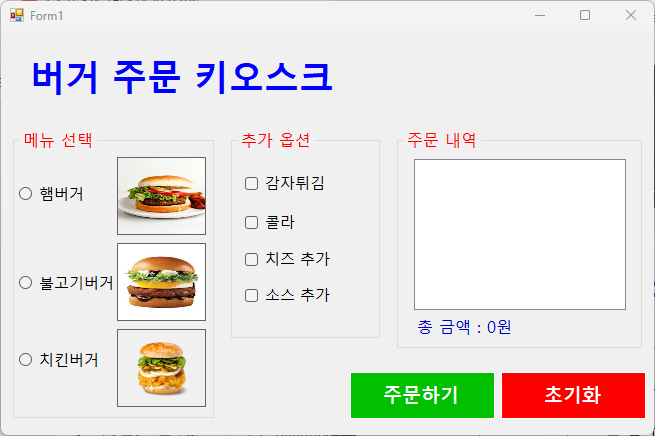
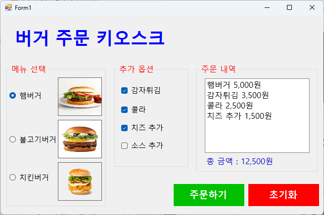
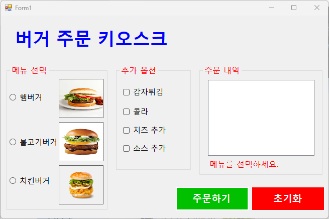
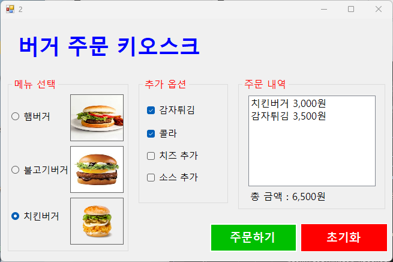
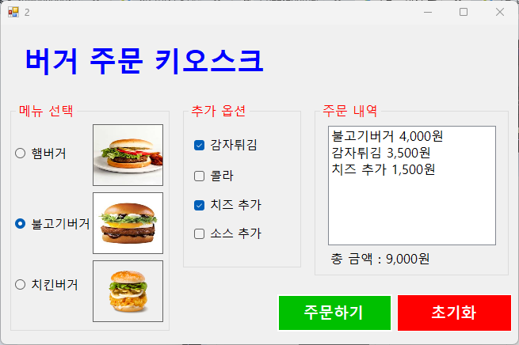

# (C# 코딩) 버거 키오스크

## 개요
- C# 프로그래밍 학습
- 1줄 소개 : 사용자로부터 마우스/키보드 입력을 받아 메뉴를 받는 키오스크 프로그램
- 사용한 플랫폼:
    - C#, .NET Windows Forms, Visual Studio, GitHub
- 사용한 컨트롤:
    - RadioButton (메뉴 단일 선택), CheckBox (사이드 메뉴 다중 선택)
    - ListBox (주문 내역 리스트 출력), Label (총 금액 및 안내 메시지 표시)
    - Button (주문 실행 및 데이터 초기화), GroupBox (항목별 그룹화)
- 사용한 기술과 구현한 기능:
    - 컨트롤의 Checked 속성을 활용한 사용자 선택 데이터 추출 및 조건별 분기 처리
    - 산술 연산을 통한 실시간 합계 금액 계산 및 ToString("N0")을 이용한 세 자리 쉼표 포맷팅
    - 메뉴 미선택 시 Label 텍스트와 ForeColor 속성을 변경하여 안내하는 시각적 예외 처리 기능
    - 컨트롤 상태 값 리셋 및 리스트 박스 Clear를 통한 재주문 초기화 기능 구현
    - 이벤트 기반 프로그래밍을 활용한 UI 요소와 데이터 연산 로직 연동

## 실행 화면
- 코드의 실행 스크린샷과 구현 내용 설명

- 구현한 내용 (위 그림 참조)
    - WinForm 컨트롤을 이용한 기본적인 키오스크 UI 배치 및 그룹화
    - 메뉴(단일 선택)와 추가 옵션(복수 선택) 항목의 가격 데이터 설정
    - 주문하기 버튼 클릭 시 선택 항목 추출 및 합계 금액 계산 기능 구현
    - 컨트롤 구성: `hamburger`, `bulgogi`, `chicken`은 RadioButton으로, `fried`, `coke`, `cheese`, `source`는 CheckBox로 배치하여 선택 로직을 구분함
    - 데이터 처리: 각 항목별 정해진 가격(햄버거 5,000원, 불고기버거 4,000원 등)을 `totalCost` 변수에 누적 합산하도록 설계함
    - 출력 기능: 주문 내역은 `list`(ListBox)에 메뉴명과 가격을 추가하고, 총 금액은 `total`(Label)에 3자리 쉼표 포맷(`N0`)을 적용하여 표시함
    - 초기화 기능: `reset_button` 클릭 시 모든 선택 상태를 해제하고 리스트박스와 금액 라벨을 초기 상태로 되돌림

## 실행 화면
- 코드의 실행 스크린샷과 구현 내용 설명

- 구현한 내용 (위 그림 참조)
    - 사용자 실수 방지를 위한 입력 검증 및 예외 처리 로직 추가
    - 팝업창(MessageBox) 대신 화면 내 Label을 활용한 에러 메시지 출력
    - 조건부 분기 처리를 통한 동적 UI 피드백 구현
    - 예외 처리 로직: `btn_order` 클릭 시 메인 메뉴인 RadioButton 항목이 하나도 선택되지 않았는지(`!Checked`) 여부를 우선적으로 검사함
    - 에러 메시지 통합: 메뉴 미선택 시 별도의 팝업창을 띄우는 대신, 기존의 `total` 라벨 텍스트를 "메뉴를 선택하세요."로 변경하여 안내함
    - 시각적 강조: 에러 상황을 사용자가 즉각 인지할 수 있도록 라벨의 글자색(`ForeColor`)을 빨간색(Color.Red)으로 변경하여 표시함
    - 상태 복구: 사용자가 메뉴를 다시 선택하거나 초기화 버튼을 누를 경우, 에러 문구를 지우고 글자색을 원래대로(Color.Black) 복구하도록 구현함

## 실행 화면
- 코드의 실행 스크린샷과 구현 내용 설명

- 구현한 내용 (위 그림 참조)
    - 마우스 없이 키보드 입력만으로 주문 및 초기화가 가능한 환경 구축
    - Tab 키와 방향키를 이용한 직관적인 포커스 이동 경로 설계
    - 엔터(Enter) 키 및 스페이스바(Space)를 활용한 주요 기능 실행 로직 구현
    - Tab 및 TabIndex 설정: 모든 입력 컨트롤에 `TabIndex`를 부여하여 메뉴 -> 옵션 -> 주문 버튼 -> 초기화 버튼 순으로 논리적인 이동이 가능하도록 설정함
    - 방향키 및 스페이스바 활용: RadioButton 그룹 내에서 방향키로 메뉴를 탐색하고, CheckBox에서 스페이스바로 항목을 선택/해제할 수 있도록 윈도우 표준 접근성을 적용함
    - AcceptButton 및 CancelButton: 폼의 `AcceptButton` 속성에 주문하기 버튼을, `CancelButton` 속성에 초기화 버튼을 연결하여 키보드 엔터와 ESC 키로 즉시 실행되도록 구현함
    - 초기화 후 포커스 복구: 모든 항목을 해제한 후에도 `Tab` 키 이동이 끊기지 않도록 첫 번째 메뉴 항목에 포커스나 체크 상태를 강제로 부여하여 키보드 흐름을 유지함
    - TabStop 최적화: 사용자가 직접 선택할 필요가 없는 결과 라벨(`total`) 및 리스트박스(`list`)의 `TabStop`을 False로 설정하여 불필요한 멈춤 현상을 제거함

## 실행 화면
- 코드의 실행 스크린샷과 구현 내용 설명

- 구현한 내용 (위 그림 참조)
    - 항목(RadioButton, CheckBox) 선택 즉시 리스트박스와 합계 금액 라벨 갱신
    - 탭(Tab) 키 동선을 최적화하여 불필요한 입력을 줄이고 주문 버튼으로의 접근성 향상
    - 체크박스 그룹 내에서 방향키를 이용해 항목 간 이동이 가능하도록 커스텀 로직 구현
    - 프로그램 시작 및 초기화 시 특정 항목이 강제로 선택되지 않도록 상태 제어
    - 실시간 데이터 동기화: 모든 메뉴 및 옵션 컨트롤에 `CheckedChanged` 이벤트를 연결하고, 상태 변화 시마다 `UpdateOrderInfo()` 함수를 호출하여 화면 정보를 즉각 반영함
    - 키보드 하이패스 동선: 체크박스 그룹의 첫 번째 항목만 `TabStop`을 부여하고 리스트박스는 제외하여, 탭 키 한 번으로 [메뉴] -> [옵션 구역] -> [주문 버튼]으로 빠르게 이동하도록 설계함
    - 방향키 기반 옵션 탐색: 체크박스에 `KeyDown` 이벤트를 활용한 `SelectNextControl` 로직을 적용하여, 옵션 구역 내에서는 상하좌우 방향키로 이동하고 스페이스바로 선택할 수 있도록 구현함
    - 포커스 및 자동 선택 방지: 윈도우 폼의 기본 동작인 라디오버튼 자동 체크를 막기 위해 `Shown` 이벤트 시점에 `ActiveControl = null`을 설정하여 사용자에게 깨끗한 초기 상태를 제공함
    - 입력 유효성 검사: 실시간 갱신 중에도 주문하기 버튼 클릭 시 메인 메뉴 선택 여부를 최종적으로 확인하여 데이터 누락이 없도록 예외 처리를 유지함
